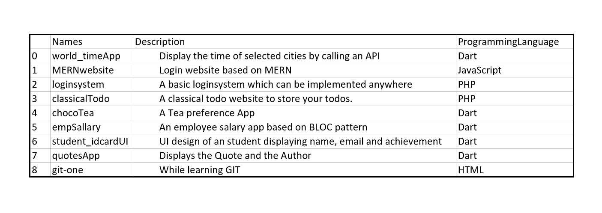

# gitRepo

Maintains a report of repository in someones github account

## Goal 

My way of increasing productivity

## Library used
  
  - [Request](https://pypi.org/project/requests/)
  - [Pandas](https://pypi.org/project/pandas/)
  - [BeautifulSoup](https://pypi.org/project/beautifulsoup4/)

### Screenshots

  
  
